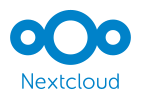
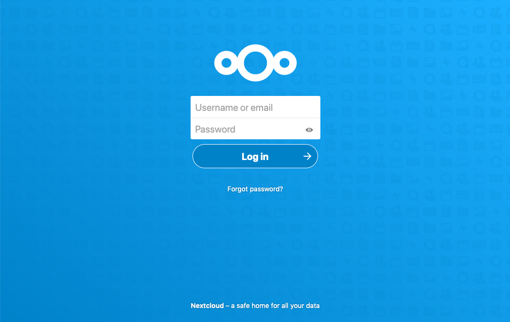

# **Nextcloud**

Slides voor de Nextcloud workshop van het IT-lab


---

 <!-- Plaats voor logo voor openingsslide, foefel gerust met de sizes van de bg -->

---


# Meevolgen op:

https://nextcloud-workshop.it-lab.be/slides <!-- URL naar de slides -->

 <!-- QR-code naar de slides -->

---

# Wat is Nextcloud?

- Jouw eigen private cloud
- Grafische interface om eenvoudig in te loggen en bestanden te beheren
  
 <!-- Plaats voor logo voor openingsslide, foefel gerust met de sizes van de bg -->


---

# Waarom Nextcloud?

- Eigen beheer van data
- Transparantie en security
- Gebruiksvriendelijkheid!


---

# Demo - Docker

- Opzetten van een eigen Nextcloud instantie
- Testomgeving!!
- Componenten: applicatie + databank

---

# Compose file


<style scoped>
code {
   font-family:  "Times New Roman", Times, serif;
   overflow-y: auto;
   max-height: 400px;
}
</style>

```
services:
  db:
    container_name: 'mariadb'
    image: mariadb:10.6
    restart: always
    command: --transaction-isolation=READ-COMMITTED --log-bin=binlog --binlog-format=ROW
    volumes:
      - /home/vagrant/nextcloud/database:/var/lib/mysql
    environment:
      - MYSQL_ROOT_PASSWORD=test
      - MYSQL_PASSWORD=test
      - MYSQL_DATABASE=nextcloud
      - MYSQL_USER=nextcloud

  app:
    container_name: nextcloud
    image: nextcloud:29.0.2
    restart: always
    ports:
      - 8080:80
    links:
      - db
    volumes:
      - /home/vagrant/nextcloud/nextcloud:/var/www/html
    environment:
      - MYSQL_PASSWORD=test
      - MYSQL_DATABASE=nextcloud
      - MYSQL_USER=nextcloud
      - MYSQL_HOST=db
```

---

# Inloggen

- Deze use case: surfen naar <ip>:8080 (localhost:8080, 192.168.10.10:8080, ...)
- Admin gebruiker aanmaken
- Beginnen met customizen!

---

# Features

- Beheren en managen van gebruikers
- Shared folders
- Verschillende apps

---

# Gebruikers

- Maak als administrator gebruikers aan
- Zet permissies in voor elke gebruiker
- Groepen managen
- Beheer zo toegang op jouw eigen cloud

---

# Shared Folders

- Mappen en directories die je deelt met andere gebruikers
- Handig voor gedeelde foto's, informatie, ...
- Persoonlijk gebruik - persoonlijke cloud voor familie 
- Businessgebruik - klantenportaal

---

# Apps

- Verschillende toepassingen beschikbaar
- Zaken zoals een kalender, foto-app, muziek, ...
- Indien wenselijk: je zou er zelf ook kunnen creëren

---

# Integraties en mogelijkheden

- Single Sign-On
- Nextcloud app
- OnlyOffice (integratie met Teams!)

---

# Customization

- Heel wat opties
- Leuk voor (personal) branding
- Feel free to experiment!

---

